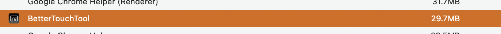
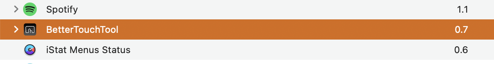
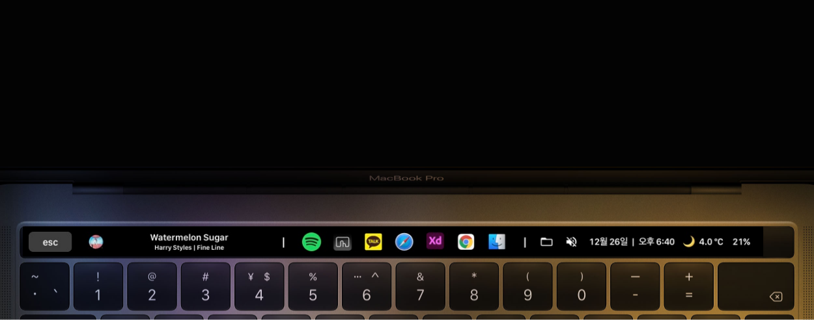
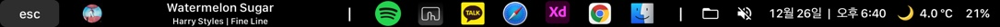

# GoldenRabbit-BTT

만약 당신이 한국인이라면 [여기](./README_for_korean.md)를 누르세요.
## What is the "GoldenRabbit-BTT"?
GoldenRabbit-BTT is inspired by the [Golden Choas preset](https://community.folivora.ai/t/goldenchaos-btt-the-complete-touch-bar-ui-replacement/1281)
Thanks for the original project, Golden :)

This is the __MacBook's Touch Bar 'BTT Preset'__ that I customized.\
The reason that I made this, is that the Golden Chaos preset is excellent functionality wise, but it was using a lot of memory, and was too slow for my liking.

I hope that this will be of use for anybody out there that had the same thoughts.

## Optimization

I optimized the preset and added more functionality.\
I deleted functionality that I deemed unneeded/unused.\
All applescript has been raplaced by the btt-widget so the stress of the process is reduced.\
All the settings have been tweaked with performance in mind.

The result is amazing.

It only uses about __'30MB'__ to run!!

It's energy consumption is similar to spotify(not playing) and iStat menus, meaning it won't noticably affect your battery life.

## Preview

### __Main strip__

Here we have the \
__esc key, music control, App swicher, Finder button, Mute button \
Date & Time, Weather and Battery__

#### You can also change 'display lightness' and 'volume' at main strip

#### Volume control
- swipe the touchbar right and left by __'TWO FINGERS'__

#### Display control 
- swipe the touchbar right and left by __'THREE FINGERS'__

## How can I use this preset??
1. Click the latest file from the 'Releases' section on the right side of this page. 

2. Download 'GoldenRabbit.bttpreset' file from the Assets session.
     
3. Import this on your 'BTT'\
   Menubar(top of the screen) -> 'Presets' -> 'Import Preset' -> choose the file -> Import
   
   
## 버전 기록
### v1.0
- golden chaos 프리셋으로부터 겹쳐서 표시되는 부분은 설정을 바꿔고 사용하지 않는 기능은 삭제하여 최적화를 진행하였습니다.
- golden chaos 프리셋으로부터 수정되었기 때문에 해당 프리셋이 없으면 작동이 되지 않았습니다.

### v2.0
- 프리셋을 새로 만들어 의존성을 완전히 해결하였습니다.
- 이 과정에서 golden chaos의 기능을 btt-widget으로 대체하여 프로세스에서 applescript를 모두 삭제하였습니다.\
  이를 통하여 프로세스의 스트레스가 크게 줄었습니다.\
  (golden chaos는 모든 기능을 매 초마다 applescript를 사용하여 구현하였지만 btt-widget은 시스템에서 해당 정보를 가져오는 구조이기에 스트레스가 덜합니다.)

### v2.1 (9/15)
- 메인 스트립의 앱 스위처를 기존 6개에서 7개로 늘려 균형을 맞췄습니다.
- 메인 스트립의 파인더와 뮤트 버튼의 크기를 재조정해 버튼을 누를 시에 겹치는 현상을 해결하였습니다.
- 옵션 스트립의 밝기 조절 위젯과 볼륨 조절 위젯의 시인성이 더 좋은 노브로 변경하였습니다.

### v2.2 (12/26)
- 메인 스트립의 균형을 다시 맞추었습니다.

### v3.0 (2021/4/8)
- 옵션 스트립의 음량 조절, 밝기 조절 슬라이더를 삭제하고, 메인 스트립에 스와이프로 대체하였습니다.
- 옵션 스트립을 삭제했습니다.

